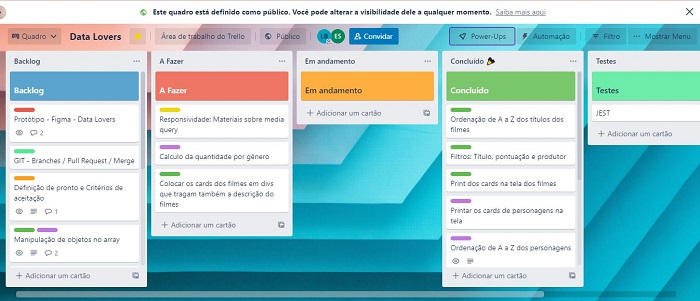
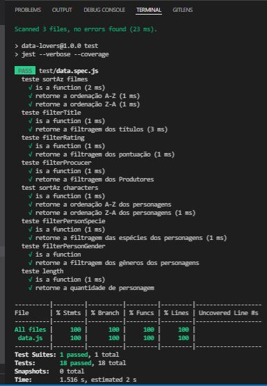
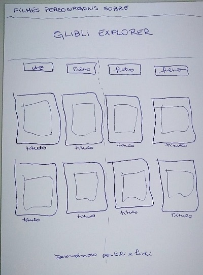
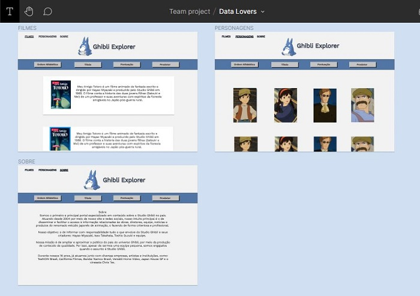
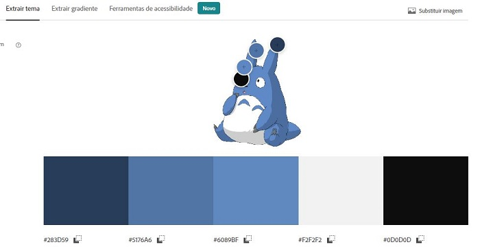
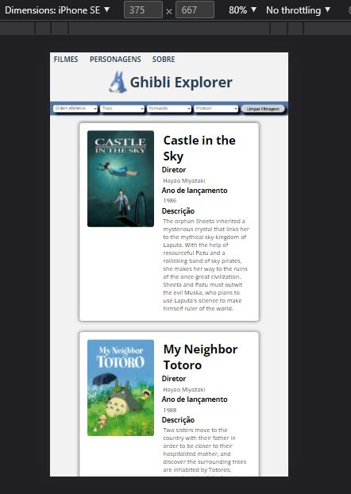

# GHIBLI EXPLORER

## Índice

- [1. Status do projeto](#1-status-do-projeto)
- [2. Acesso](#2-acesso)
- [3. Descrição](#3-descricao)
- [4. Planejamento](#4-planejamento)
- [5. Histórias de usuário](#5-historias-de-usuário)
- [6. Protótipo](#6-prototipo)
- [7. Funcionalidades](#7-funcionalidades)
- [8. Tecnologias utilizadas](#8-tecnologias-utilizadas)
- [9. Pessoas desenvolvedoras](#9-pessoas-desenvolvedoras)
- [10. Referências](#10-referencias)

## 1. Status do projeto

-  

## 2. Acesso

O deploy do projeto foi realizado pelo Git Pages. [Clique aqui](https://elizenai.github.io/SAP007-data-lovers/index.html) para acessá-lo.

## Como usar
Você precisará usar o Node.js e clonar o projeto.

- Instalar as dependências:
npm install

- Iniciar a aplicação:
npm start

- Realizar os testes unitários:
npm test 

## 3. Descrição

O Studio Ghibli é uma companhia de cinema e animação que conquistou reconhecimento e aclamação internacional pela qualidade de seus vários longas-metragens de animação. Uma curiosidade sobre Hayao Miyazaki, co-fundador da companhia, é que ele normalmente escreve e dirige, sendo amplamente considerado um dos principais nomes da indústria de animação japonesa.

O objetivo do projeto foi construir uma página web onde os usuários pudessem visualizar os cards dos filmes do Studio Ghibli de forma simples e interativa, sendo possível filtrá-los, ordená-los e ter acesso às curiosidades do estúdio e suas animações. Para isso, foram utilizados os dados da [Ghibli API](https://ghibliapi.herokuapp.com/#section/Getting-Started), contidos em um arquivo ".js" somente com o necessário para o desenvolvimento do projeto.

## 4. Planejamento

Escolhemos o [Trello](https://trello.com/b/52ngg64M/data-lovers) como ferramenta para o planejamento.

## 5. Histórias de usuário

Nossa pesquisa para iniciar o projeto foi realizada com pessoas da família que assistem esse tipo de animação, além da Pesquisa com seguidores de Studio Ghibli disponibilizada no projeto.

Abaixo estão as duas histórias de usuário que motivaram o desenvolvimento do design, paleta de cores, filtros, e demais interatividades do projeto.
### História de usuário 01
-Eu, Heloísa, 09 anos, quero entrar no site do Studio Ghibli e poder ver todos os nomes e posteres dos filmes. Eu quero saber um pouco da história pra decidir qual filme assistir.

_Definição de pronto_: Ao entrar na site, o usuário tem acesso à página de filmes. Nesta mesma página, é possível ordenar os títulos dos filmes de A a Z, selecionar um único título para que apareça somente ele na tela, filtrar pela pontuação dos filmes e pelo produtor. Também é possível limpar os filtros para fazer uma nova pesquisa.
_Critérios de aceitação_: Para cada filme foi montado um display contendo o poster, o título, o nome do diretor, o ano de lançamento e a descrição do filme, sendo possível conhecer a história e saber se o filme foi bem aceito.
### História de usuário 02
-Eu Matheus, 25 anos,  quero entrar no site da Ghibli e poder ver todos os personagens, saber os tipos ou espécies, o gênero e a quantidade que cada um representa nas animações em geral.

_Definição de pronto:_ Ao entrar no site, o usuário estará na página de filmes e terá acesso à página de personagens utilizando um menu localizado no canto superior esquerdo da tela. A página de personagens mostra todos os cards e nomes dos personagens, sendo possível ordenar os nomes de A a Z, filtrar por espécie, gênero e com isso obter a quantidade dessas categorias. Também é possível limpar os filtros para fazer uma nova pesquisa.
_Critérios de aceitação_: O usuário pode navegar na página pela barra de rolagem e conhecer todos os personagens, utilizar os filtros para conhecer as espécies existentes e obter a quantidade por gênero e espécie.
### Testes de usabilidade

Durante o desenvolvimento, fizemos alguns testes com os usuários para que pudessem avaliar a interatividade do site, então decidimos adicionar no canto direito da tela um botão para limpar os filtros antes de fazer uma nova pesquisa.

### Testes unitários

Para os testes unitários, utilizamos as funções Describe e It, da biblioteca do [Jest](https://jestjs.io/pt-BR/docs/using-matchers). Apenas as funções escritas no arquivo data.js foram testadas, pois é neste arquivo que estão os escopos das funções que ordenam e filtram. Essas funções são chamadas na main.js e characters.js para serem executadas com os parâmetros estabelecidos para a pesquisa. 

## 6. Protótipo

Após algumas pesquisas em sites similares como: sites de desenho animado, jogos, filmes de anime e mesmo o site do [Studio Ghibli Brasil](https://studioghibli.com.br/studioghibli/), desenhamos os protótipos:
#### Protótipo de baixa fidelidade

#### Protótipo de alta fidelidade

- [Protótipo no figma](https://www.figma.com/file/y63N4eDBrqPoQr6J6SY9q3/Data-Lovers?node-id=0%3A1)

## Paleta de cores

Utilizamos o [Adobe Colors](https://color.adobe.com/pt/create/color-wheel) para extrair as cores através da imagem escolhida.

## 7. Funcionalidades

Layout responsivo, facilidade de navegação entre páginas e opções de filtros para pesquisa.

## 8. Tecnologias utilizadas

- JavaScript
- HTML 5
- CSS
- Node.JS
- Figma
- Jest

## 9. Pessoas desenvolvedoras

Este projeto foi desenvolvido durante o Bootcamp da Laboratória, Turma 007 pelas colaboradoras: 

- [Elizenai Silva](https://www.linkedin.com/in/elizenai/)

- [Lidianne Barbosa](https://www.linkedin.com/in/lromao/)

## 10. Referências

- [Ghibli na Netflix](https://www.netflix.com/br/browse/genre/81227213)
- [Studio Ghibli](https://ghiblicollection.com/)

