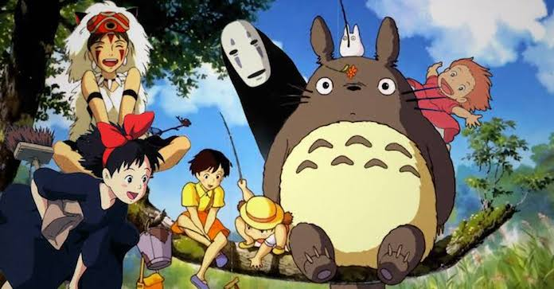
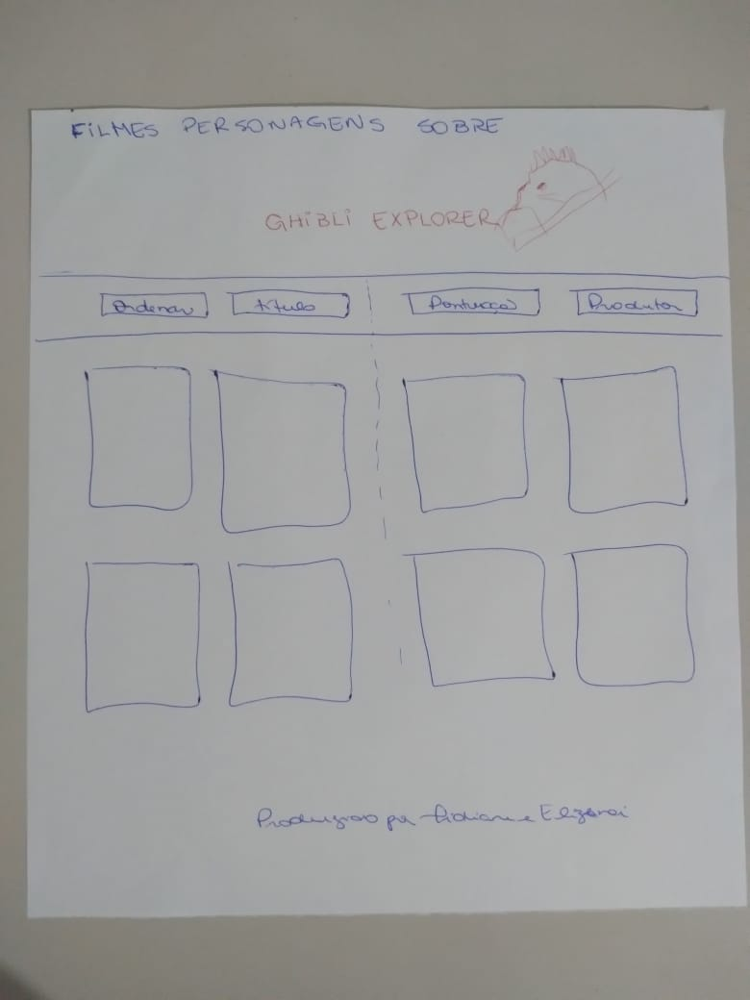

# Studio Ghibli

## 4. Status do projeto

## Índice

- [1. Descrição do projeto](#1-descricao-do-projeto)
- [2. Acesso](#2-acesso)
- [3. Funcionalidades](#3-funcionalidades)
- [4. Status do projeto](#4-status-do-projeto)
- [5. Protótipo](#5-prototipo)
- [6. Histórias de usuário](#6-historias-de-usuário)
- [7. Tecnologias utilizadas](#7-tecnologias-utilizadas)
- [8. Pessoas desenvolvedoras](#8-pessoas-desenvolvedoras)
- [9. Referências](#9-referencias)

## 1. Descrição do projeto

- [Studio Ghibli](src/data/ghibli/ghibli.json).
  Lista de animações e personagens do [Studio Ghibli](https://ghiblicollection.com/).
- [Pesquisa com seguidores de Studio Ghibli](src/data/ghibli/README.pt-BR.md)

## 2. Acesso

## 3. Funcionalidades

## 5. Protótipo

Após algumas pesquisas em sites similares e breve conversa com usuários, decidimos que o site deveria ser de fácil compreensão, com a finalidade de adultos e crianças poderem ter acessos a todas as funcionalidades.

#### Protótipo de baixa fidelidade

Depois de realizar algumas pesquisas em sites similares como: sites de desenho animado, jogos, filmes de anime e mesmo o site do [Studio Ghibli Brasil] (https://studioghibli.com.br/studioghibli/), desenhamos no papel como seria a página principal:

#### Protótipo de alta fidelidade

*** figma

## 6. Histórias de usuário

Nossa pesquisa para iniciar o desenvolvimento foi realizada com pessoas da família que assistem desenhos de anime e também através de buscas de comunidades que falam sobre esse tipo de animação. Iremos descrever as duas histórias de usuário que serviram como direcionamento para a elaboração dos filtros, definição de cores e demais informações.

História de usuário 01
-Eu, Heloísa, 09 anos, quero entrar no site do Studio Ghibli e poder ver todos os posteres dos filmes para decidir que filme assistir.  Gostaria de encontrar os títulos, saber quais são os melhores e poder ler a descrição.

Definição de pronto:
Critérios de aceitação:

História de usuário 02
-Eu Matheus, 10 anos,  quero entrar no site da Ghibli e poder ver todos os personagens, saber os tipos, o gênero e a quantidade que cada um representa.

Definição de pronto:
Critérios de aceitação:

#### Testes de usabilidade

Durante o desenvolvimento, fizemos alguns testes com os usuários para que pudessem avaliar a interatividade do site.

### Testes unitários

No mínimo, sua implementação deverá:

1. Mostrar os dados em uma interface: pode ser em cards, tabelas, listas, etc.
2. Permitir ao usuário interagir com a interface para obter as informações que
   necessita;
3. Ser _responsiva_, ou seja, deve ser visualizada sem problemas a partir de
   diversos tamanhos de tela: celulares, tablets, notebooks, etc.
4. Que a interface siga os fundamentos de _visual design_.

## 7. Tecnologias utilizadas

## 8. Pessoas desenvolvedoras

## 9. Referências

### Checklist

- [ ] Usar VanillaJS.
- [ ] Passa pelo linter (`npm run pretest`)
- [ ] Passa pelos testes (`npm test`)
- [ ] Testes unitários cobrem um mínimo de 70% de statements, functions, lines e
      branches.
- [ ] Inclui uma _definição de produto_ clara e informativa no `README.md`.
- [ ] Inclui histórias de usuário no `README.md`.
- [ ] Inclui rascunho da solução (protótipo de baixa fidelidade) no `README.md`.
- [ ] Inclui uma lista de problemas detectados nos testes de usabilidade no
      `README.md`.
- [ ] UI: Mostra lista/tabela/etc com dados e/ou indicadores.
- [ ] UI: Permite ordenar dados por um ou mais campos (asc e desc).
- [ ] UI: Permite filtrar dados com base em uma condição.
- [ ] UI: É _responsivo_.
