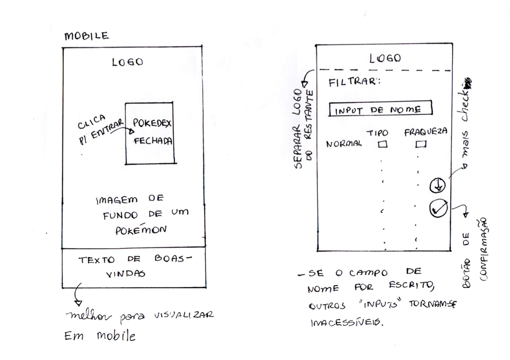
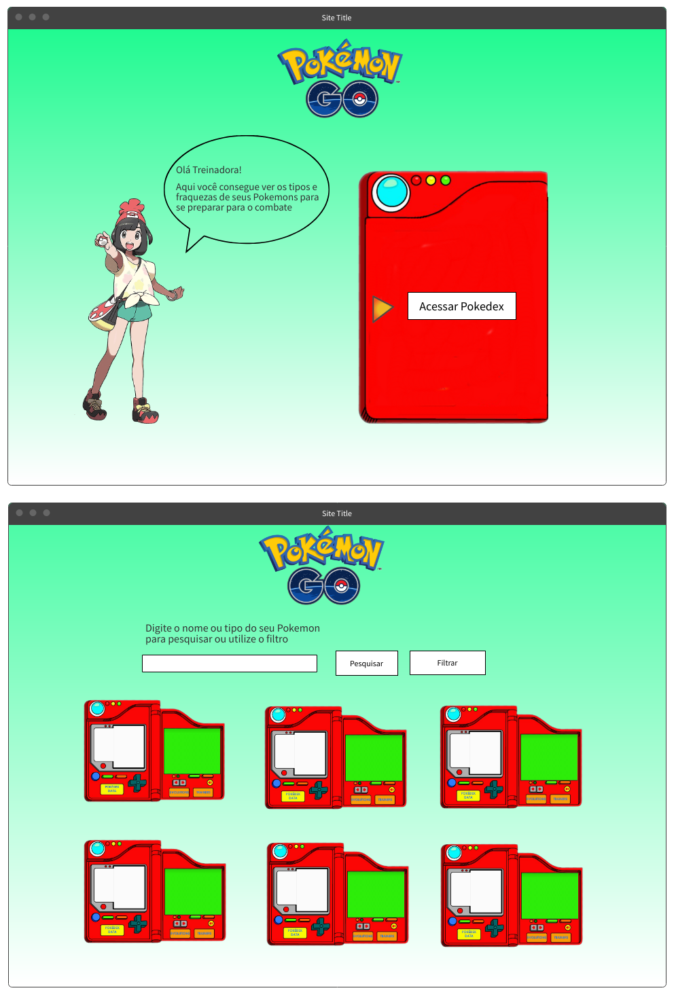

   

## Escolha os seus Pokemóns para combate, filtrando por tipo e fraqueza.

  
  
  

---
  
## ÍNDICE

- [Escolha os seus Pokemóns para combate, filtrando por tipo e fraqueza.](#escolha-os-seus-pokemóns-para-combate-filtrando-por-tipo-e-fraqueza)
- [ÍNDICE](#índice)
- [1. PRODUTO](#1-produto)
  - [1.1. Pokémon](#11-pokémon)
  - [1.2. Histórias de Usuários](#12-histórias-de-usuários)
  - [1.3. OnPokemon](#13-onpokemon)
- [2. PROTÓTIPOS](#2-protótipos)
  - [2.1. Protótipo de Baixa Fidelidade](#21-protótipo-de-baixa-fidelidade)
  - [2.2. UX (Experiência do Usuário) e UI (Design de Interface)](#22-ux-experiência-do-usuário-e-ui-design-de-interface)
- [2.3 Protótipos de Alta Fidelidade](#23-protótipos-de-alta-fidelidade)
  - [2.3.1 Smartphone na Posição Vertical](#231-smartphone-na-posição-vertical)
  - [2.3.2 Smartphones na Posição Horizontal](#232-smartphones-na-posição-horizontal)
  - [2.3.3 Tablet na Posição Vertical](#233-tablet-na-posição-vertical)
  - [2.3.4. Table na Posição Horizontal](#234-table-na-posição-horizontal)
  - [2.3.5. Desktop](#235-desktop)
- [3. TESTE DE USABILIDADE](#3-teste-de-usabilidade)
- [4. FERRAMENTAS UTILIZADAS](#4-ferramentas-utilizadas)
- [5. CHECKLIST](#5-checklist)
- [6. AUTORAS](#6-autoras)

---
  
## 1. PRODUTO

### 1.1. Pokémon

Pokémons são criaturas de todas as formas e tamanhos que podem ser selvagens ou então aparecer ao lado de seus parceiros treinadores. Durante suas aventuras, os Pokémons crescem e se tornam mais experientes e evoluem para se tornarem Pokémons ainda mais fortes. Centenas de Pokémon conhecidos habitam o universo Pokémons, com números incontáveis esperando para serem descobertos!

Há 18 tipos diferentes de Pokémons e cada um pode ter até dois, como no caso do Bulbasaur, que é grama e venenoso. Cada tipo tem maior ou menor chance do golpe usado causar dano no inimigo, o resultado dependerá do tipo do adversário e se o seu ataque é do seu mesmo tipo.
  
Os Pokémons têm diferentes tipos e fraquezas em combate. Estas características são importantes na escolha do Pokémon mais adequado para sua batalha. Às vezes, você tem que escolher aqueles com menos fraquezas e saber de que tipo eles são. Portanto, é importante que um mestre de Pokémon seja capaz de ordená-los por essas 2 características.

### 1.2. Histórias de Usuários

> "Eu, como treinadora iniciante do jogo [Pokémon Go](https://play.google.com/store/apps/details?id=com.nianticlabs.pokemongo&hl=pt_BR&gl=US), desejo pesquisar os meus Pokémons, filtrando-os por tipos e fraquezas, para escolher os mais adequados para as minhas batalhas no jogo.
  
> "Como treinador do jogo Pokémon Go, quero buscar mais de um nome dos meus Pokémons, ordenando-os por tipos e visualizando mais informações sobre cada um deles, descobrindo suas fraquezas, desse modo poderei batalhar mais confiante para ser um mestre Pokémon."
  
### 1.3. OnPokemon

_OnPokemon_ é um site de filtragem em Pokémons por: nome, tipos e fraquezas de cada um deles. Os resultados da pesquisa são mostrados na tela, ordenados por números da [Pokédex Nacional](https://pokemon.fandom.com/pt-br/wiki/Pok%C3%A9dex_Nacional), por nomes em ordem alfabética crescente e decrescente e, podendo serem mesclados pela maior ou menor quantidade de fraquezas.

Os principais usuários do _OnPokemon_, são os jogadores (treinadores) que desejam saber informações sobre seus Pokémons para batalhar com outros treinadores no jogo Pokémon Go. Para eles, é essencial saber o tipo e fraquezas de seus Pokémons e poder visualizá-los em qualquer lugar, como em smartphone, tablet e notebook, sem alterar as configurações visuais dos dados mostrados na tela.
  
## 2. PROTÓTIPOS

- OnPokemon é um projeto desenvolvido em 2022, para o bootcamp da Laboratoria Brasil.
- Esse projeto é baseado nas instruções apresentadas pelo README do [Data-love](https://github.com/Laboratoria/SAP007-data-lovers).
- Para iniciar o projeto, iniciamos com um planejamento realizado no site Trello, com base em [Babys Steps](https://blogprisma.com.br/baby-steps/) e na metodologia [Scrum](http://www.desenvolvimentoagil.com.br/scrum/), com sprints de uma semana, totalizando em quatro sprints.

### 2.1. Protótipo de Baixa Fidelidade

- Para realizar o projeto do bootcamp Laboratoria, foi realizado primeiro um protótipo simples (baixa fidelidade) usando papel e lápis. Neste protótipo, foi pensado no conceito de [Mobile First](https://www.chiefofdesign.com.br/design-responsivo/mobile-first/) que prioriza quais elementos são prioridade na exibição para o usuário e quais podem ser descartados.
- No _OnPokemon_ foi priorizado as informações essenciais, como: explicação sobre o uso do site, explicações para preenchimento do formulário de filtragem e nos resultados visualizados.

    - _**PARA MOBILE (smartphones e tablets):**_
 

         

               
         

         

             
         

    - _**PARA DESKTOP (computador e nootbook):**_
 

        

             
        

    
### 2.2. UX (Experiência do Usuário) e UI (Design de Interface)
  
- _**Estilo**_

  - OnPokemon é do estilo _**[skeumórfico](https://www.chiefofdesign.com.br/ui-design/)**_, que utiliza artifícios como texturas, sombras, gradientes e proporções, para simular os objetos reais e é muito utilizado em jogos, como o Pokémon Go. Já para o site OnPokemon, foi usado no logo para o desenho da [pokebola](https://pokepedia.fandom.com/pt/wiki/Pokeb%C3%B3la#:~:text=Este%20item%20caracteriza%20a%20s%C3%A9rie,Pok%C3%A9mon%20em%20um%20pequeno%20espa%C3%A7o.), além das imagens da [pokédex](https://pokemon.fandom.com/pt-br/wiki/Pok%C3%A9dex) fechada e aberta, dos ícones e dos campos do formulário. 

- _**Responsividade**_

  - Os tamanhos de telas utilizados no site, foram escolhidos segundo as estatísticas encontradas no site Statcounter, com base em dados coletados mundialmente. Os aparelhos eletrônicos escolhidos foram: [smartphone](https://pt.wikipedia.org/wiki/Smartphone), [tablet](https://pt.wikipedia.org/wiki/Tablet) e [desktop](https://en.wikipedia.org/wiki/Desktop_computer). 
  
    - _**Smartphone na posição vertical:**_ 360 x 640 pixels
    - _**Smartphones na posição horizontal:**_ 640 x 360 pixels
    - _**Tablet na posição vertical:**_ 600 x 962 pixels
    - _**Table na posição horizontal:**_ 962 x 600 pixels
    - _**Desktop:**_ 1280 x 720 pixels

- _**Telas e Mensagens**_

  - As informações necessárias são apresentadas em formas de textos, a qual ocupam toda a extensão da largura da tela dentro de retângulos. Para as informações secundárias, são utilizados [modal ou pop-up](https://tecnoblog.net/responde/o-que-e-pop-up/) para as  informações sobre o site e contato com a equipe OnPokemon, localizados na página inicial (home), sem precisar ir para outra página.

  - Conforme a tela do aparelho aumenta, o formulário, as escolhas das ordenações e os cards das respostas são realocados para ocuparem os espaços vazios encontrados no lado direito da tela. Cada um será feito em uma página que seguirá o seguinte caminho de navegação:
  
       - Home
          - Mais informações
          - Filtrar
            - Ordenação
              - Respostas   

- _**Botões**_
  
  - Os botões são representados em forma de ícones com símbolos universais em formato circular, mas ao passar o mouse ou o dedo sobre o ícone, ele deslizará para a esquerda, mostrando o nome da ação que o botão fará.

      

        
        
      

       

        
        
      

       

        
        
      

- _**Tipografia e Hierarquia**_

  - A [tipografia](https://www.chiefofdesign.com.br/tipografia/) escolhida possui fonte sem serifa, com a font-family: Arial, Verdana, Helvetica e Sans-Serif. São letras fáceis de serem visualizadas e lidas em aplicações da web.
  - Para visualizar a hierarquia, foi usado fontes grandes para títulos de páginas, como o logo da página home e os títulos: FILTRAR e RESULTADOS . Para destacar os últimos dois títulos, o tamanho do logo foi diminuído e aumentado nos deles, assim, não interferirá drasticamente de um título para desktop para um mobile que poderia ocupar grande parte de sua tela. 
  - Para os demais textos, obedecem a hierarquia em relação ao título da página e ao tipo de tela em que será exibido.

- _**Cores e Contrastes**_

  - As cores escolhidas para o site foram pensadas em cores neutras para combinarem com as cores das imagens dos Pokémons, além de cores que pudessem ser contrastadas entre a cor do texto e o seu plano de fundo, para facilitar a leitura e legibilidade. Para isso foi utilizado a ferramenta da _[Adobe Color](https://color.adobe.com/pt/create/color-wheel)_ que testa, na parte de acessibilidade, as cores de textos com o seu plano de fundo. Foram testadas com a cor de plano de fundo da aplicação em si, dos textos, dos botões e pop-ups.

      

        
     

      
## 2.3 Protótipos de Alta Fidelidade

- Para o desenvolvimento do protótipo de alta fidelidade, foi usado uma ferramenta digital para protótipo. A ferramenta utilizada foi o Figma, que é um editor gráfico de vetor e prototipagem de projetos de design baseado principalmente no navegador web.

### 2.3.1 Smartphone na Posição Vertical

  

### 2.3.2 Smartphones na Posição Horizontal

  

### 2.3.3 Tablet na Posição Vertical

  

### 2.3.4. Table na Posição Horizontal

  

### 2.3.5. Desktop
  

  

## 3. TESTE DE USABILIDADE

## 4. FERRAMENTAS UTILIZADAS
  
- **Planejamento:**

  - **Scrum:** _[Trello](https://trello.com)_

- **UX/UI**:

  - **Edição de Imagens:** _[Canvas](https://www.canva.com/pt_br/)_
  - **Paleta de Cores com Acessibilidade:** _[Adobe Color](https://color.adobe.com/pt/create/color-wheel)_
  - **Protótipo:** _[Figma](https://www.figma.com/)_
  - **Para fazer Gif:** _[Canvas](https://www.canva.com/pt_br/)_

- **Web:**
  - **Editor:** _[Visual Studio Code](https://code.visualstudio.com/)_
  
## 5. CHECKLIST

- [ ] Usar VanillaJS.
- [ ] Passa pelo linter (`npm run pretest`)
- [ ] Passa pelos testes (`npm test`)
- [ ] Testes unitários cobrem um mínimo de 70% de statements, functions, lines e
      branches.
- [ ] Inclui uma _definição de produto_ clara e informativa no `README.md`.
- [ ] Inclui histórias de usuário no `README.md`.
- [ ] Inclui rascunho da solução (protótipo de baixa fidelidade) no `README.md`.
- [ ] Inclui uma lista de problemas detectados nos testes de usabilidade no
      `README.md`.
- [ ] UI: Mostra lista/tabela/etc com dados e/ou indicadores.
- [ ] UI: Permite ordenar dados por um ou mais campos (asc e desc).
- [ ] UI: Permite filtrar dados com base em uma condição.
- [ ] UI: É _responsivo_.

## 6. AUTORAS 

<table>
<td>
  

     
  

  <h3 align="center"><a href="https://github.com/adrianatwatanabe">Adriana Tiemi Watanabe</a></h3>
  <h4 align="center">Projeto do Bootcamp da <em><a href="https://hub.laboratoria.la/br">Laboratoria</a></em></h4>
  

    
    
  

</td>

<td>
  

     
  

  <h3 align="center"><a href="https://github.com/BeaSCarvalho">Beatriz de Sousa Carvalho</a></h3>
  <h4 align="center">Projeto do Bootcamp da <em><a href="https://hub.laboratoria.la/br">Laboratoria</a></em></h4>
  

    
     
  

</td>
</table>
