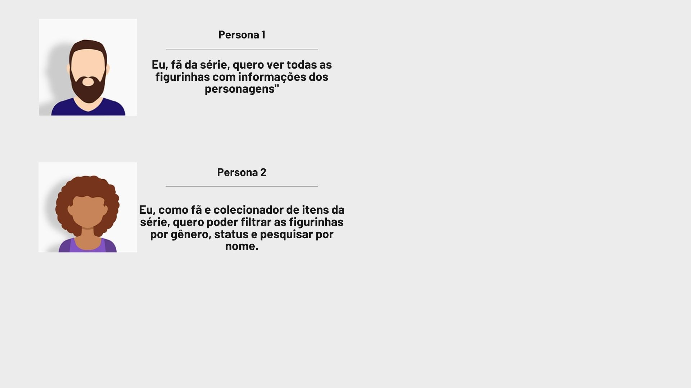
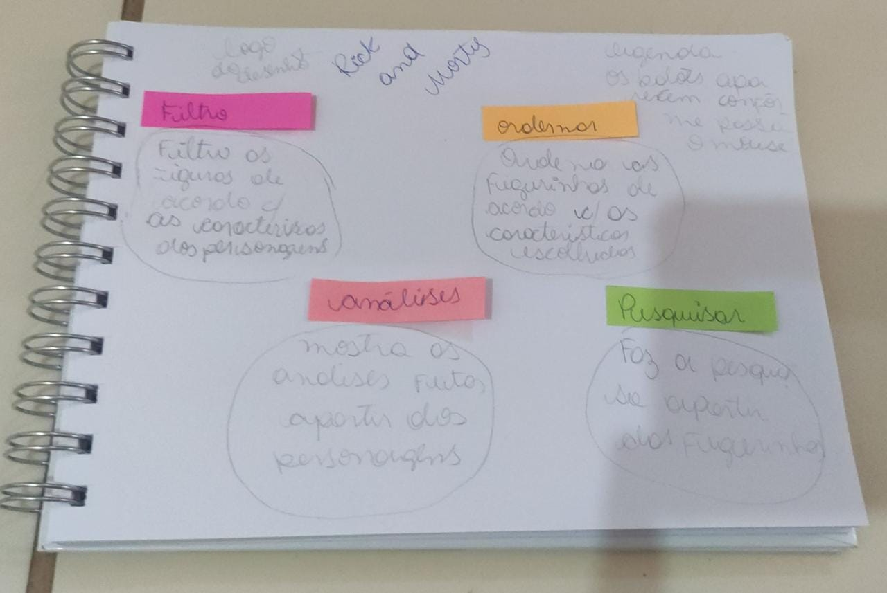
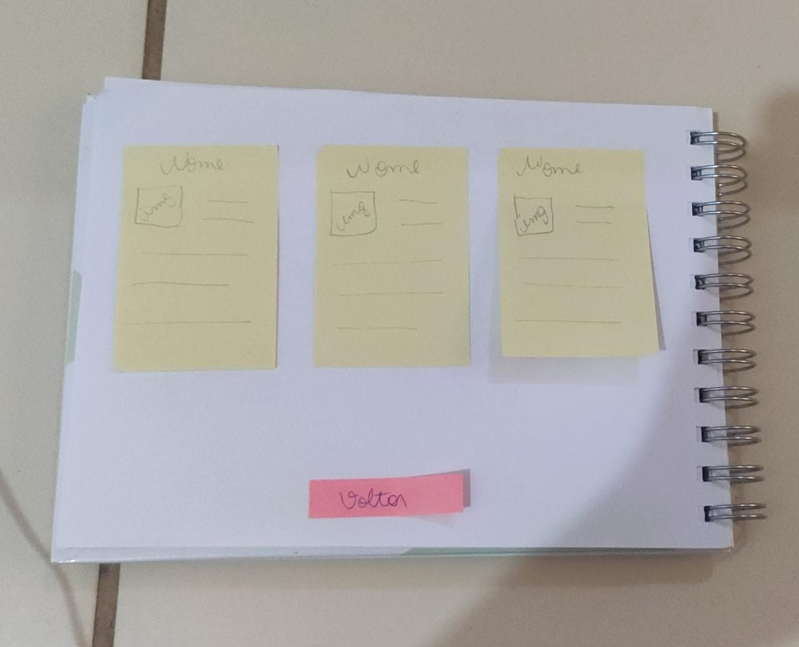
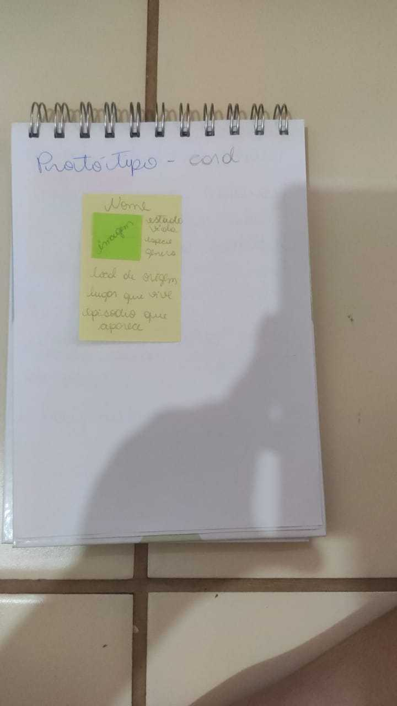
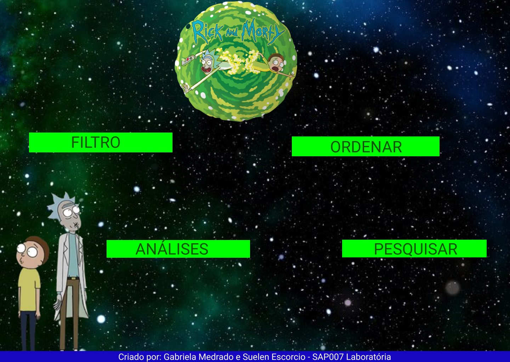
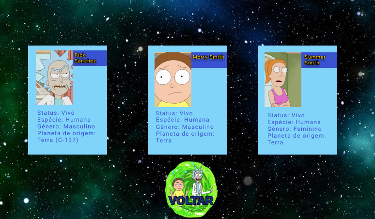

# Data Lovers - Rick and Morty

Projeto desenvolvido no Bootcamp Laboratória Brasil - SAP 007.
 
Link do [projeto](https://suelenescorcio.github.io/SAP007-data-lovers/)

## Autores

- [Gabriela Medrado](https://github.com/GabrielaMedrado)
- [Suelen Escorcio](https://github.com/suelenescorcio)

## Introdução
---

**Data Lovers - Rick and Morty** é uma ferramenta de busca de personagens da série Rick and Morty. Neste projeto você consegue filtrar os personagens por gênero, status (vivo/morto/desconhecido), ordenar por ordem alfabética além de poder pesquisar os personagens pelo nome. Ao navegar, o usuário também pode conferir cálculos agregados dos personagens e ser redirecionado para serviços de streaming que exibem a série.

O objetivo do projeto é oferecer aos fãs da série, algumas informações sobre os 493 personagens, como status, gênero, espécie e local de origem.

## Definição do Produto

---

**HISTÓRIA DE USUÁRIO**

Fãs da série que gostariam de consultar informações sobre todos os personagens. Também pensamos em um cenário futuro, onde o programa poderia ser utilizado para a criação de um álbum de figurinhas, onde cada card seria a figurinha deste álbum. O usuário entra na página e pode visualizar as figurinhas disponíveis.

### TESTES DE USABILIDADE

- Em um primeiro teste, verificamos que era necessário resetar o botão do filtro selecionado após uma próxima seleção, porque poderia causar confusão quanto ao que realmente estava sendo mostrado na tela. O problema foi resolvido, quando escolhe um filtro, o botão anteriormente escolhido volta para o índice zero.

- Após teste com usuário, foi concluído que seria interessante implementar no projeto um link para os serviços de streaming onde a série é exibida. A partir disso, colocamos um link na página inicial que redireciona para uma segunda página com os links dos streamings disponíveis.

- Os testes também mostraram que a pesquisa de todas as figurinhas gera uma página muito longa, já que são 493 personagens. Implementamos um botão que acompanha a rolagem da tela para que o usuário possa voltar para a página inicial quando quiser.

## Protótipos

---

**Protótipo de baixa fidelidade**

...

**Protótipo de alta fidelidade**

Página Inicial

Página com os cards

A ideia inicial foi alterada para uma página que redireciona para a página dos filtros, com as figurinhas, para os links com os serviços de streaming onde encontramos a série e por último uma página que contem alguns cálculos agregados com a porcentagem dos personagens.

A página completa pode ser conferida no GitHub Pages.

---

