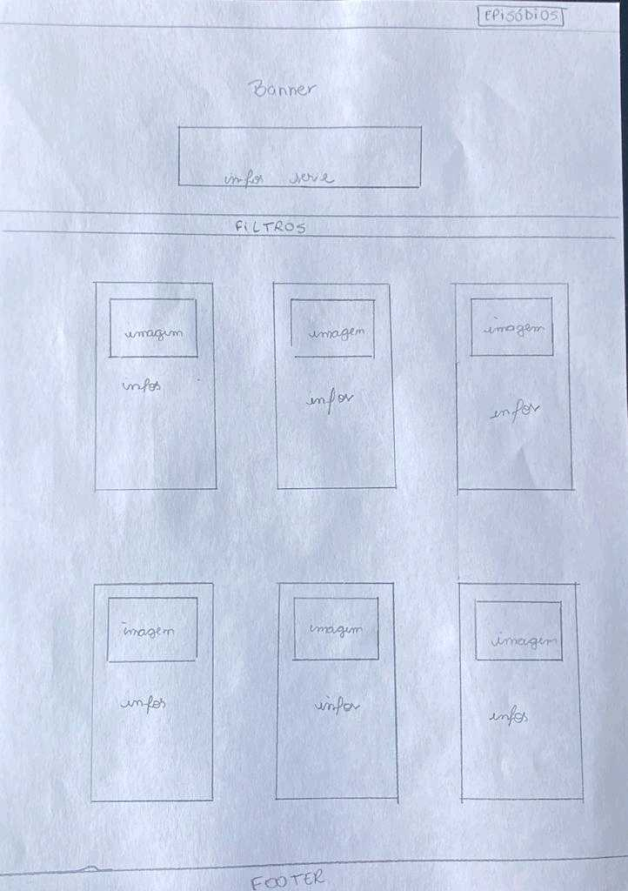
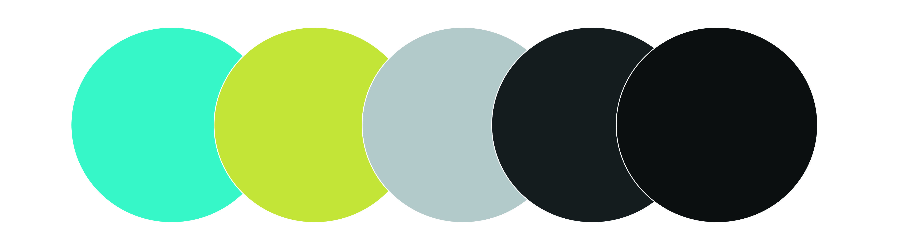
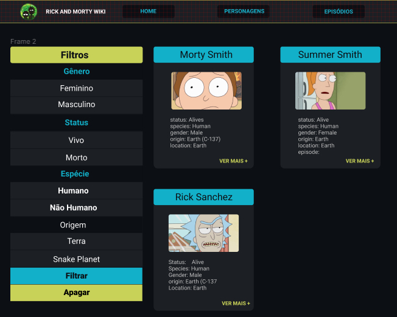

# Data Lovers

## Índice

- [1. Sobre o projeto/produto]
- [3. História de usuário]
- [4. Objetivos de aprendizagem]
- [5. Protótipos e design]
- [6. Ferramentas usadas]
- [7. Desenvolvedoras]
---

# Rick And Morty WIKI

## 1. Sobre o projeto/produto

O projeto Rick And Morty WIKI tem como objetivo final, oferecer todas as informações que um Super Fã da série americana Rick And Morty gostaria de saber.
Informações importantes como:
- Nome dos personagens
- Status de vida
- Gênero
- Localização dos personagens
- Episódios em que os personagens aparecem

E oferecer ao usuário/visitante/fã uma experiência alucinante, divertida e com muitas informações.

## 3. História de usuário
Elaboramos as histórias de usuário, pensando em primeiro lugar, em qual seria o interesse do usuário no nosso site, e como ele iria usar nosso produto e se locomover na página Rick and Morty WIKI e resolver seus interesses.

## 4. Objetivos de aprendizagem
### HTML
- [ ] **Uso de HTML semântico**
### CSS
- [ ] **Uso de seletores de CSS**

- [ ] **Empregar o modelo de caixa (box model): borda, margem, preenchimento**

- [ ] **Uso de flexbox en CSS**
### Web APIs
- [ ] **Uso de seletores de DOM**

- [ ] **Gerenciamento de eventos de DOM**

- [ ] **Manipulação dinâmica de DOM**
### JavaScript
- [ ] **Diferenciar entre tipos de dados primitivos e não primitivos**

- [ ] **Manipular arrays (filter, map, sort, reduce)**

- [ ] **Manipular objects (key | value)**

- [ ] **Variáveis (declaração, atribuição, escopo)**

- [ ] **Uso de condicionais (if-else, switch, operador ternário)**

- [ ] **Uso de laços (for, for..of, while)**

- [ ] **Uso de funções (parâmetros, argumentos, valor de retorno)**

- [ ] **Testes unitários**

- [ ] **Uso ES modules**

- [ ] **Uso de linter (ESLINT)**

- [ ] **Uso de identificadores descritivos (Nomenclatura | Semântica)**

- [ ] **Diferença entre expression e statements**
### Git e GitHub
- [ ] **Git: Instalação e configuração**

- [ ] **Git: Controle de versão com git (init, clone, add, commit, status, push, pull, remote)**

- [ ] **Git: Integração de mudanças entre ramos (branch, checkout, fetch, merge, reset, rebase, tag)**

- [ ] **GitHub: Criação de contas e repositórios, configuração de chave SSH**

- [ ] **GitHub: Implantação com GitHub Pages**

- [ ] **GitHub: Colaboração pelo Github (branches | forks | pull requests | code review | tags)**
### user-centricity
- [ ] **Desenhar a aplicação pensando e entendendo a usuária**
### product-design
- [ ] **Criar protótipos para obter feedback e iterar**

- [ ] **Aplicar os princípios de desenho visual (contraste, alinhamento, hierarquia)**

### research
- [ ] **Planejar e executar testes de usabilidade**

## 5. Protótipos e design

Nós iniciamos trazendo nossas ideias de layout e design da página para o papel

Entramos em acordo sobre as paletas de cores, sem sair do tom das paletas de cores exibida na seriado.

após a escolha das cores, iniciamos a montagem do layout pelo figma

## 6. Ferramentas usadas
- JavaScript
- Html5
- Css3
- Figma
- Git

## 7. Desenvolvedoras

- Daiane Gonçalves
- Isabela Soares
