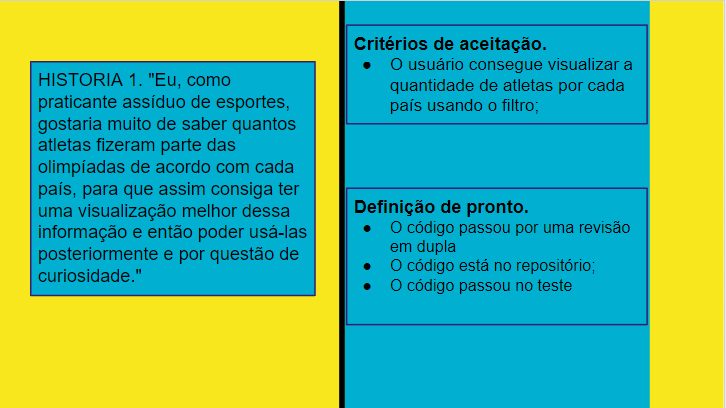
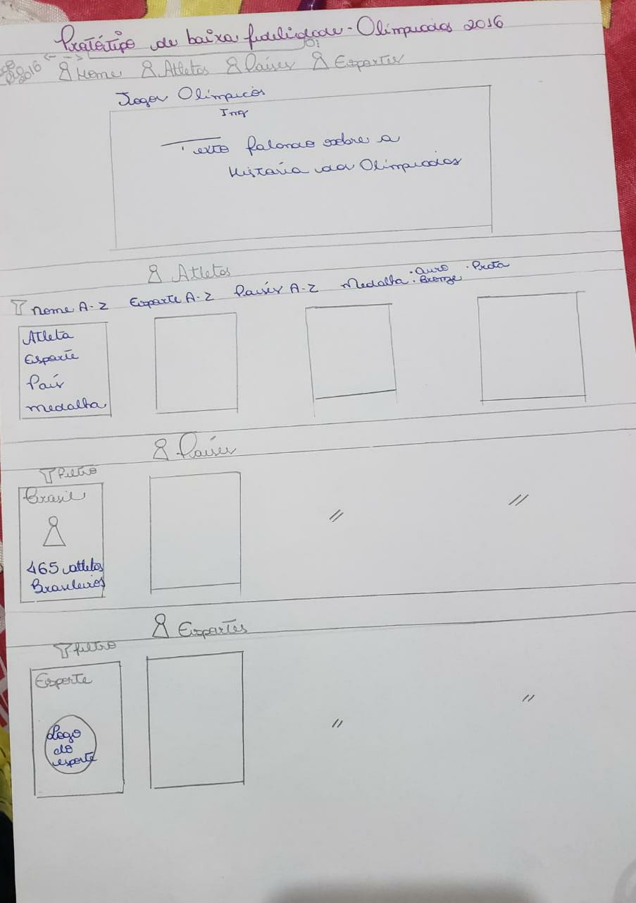
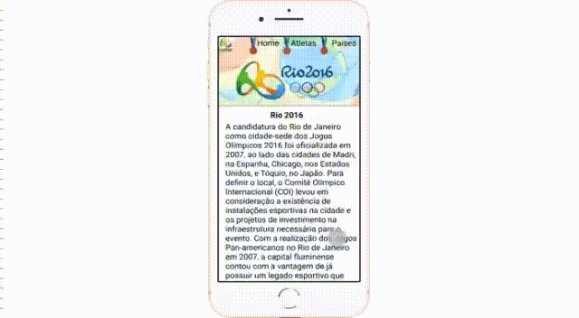
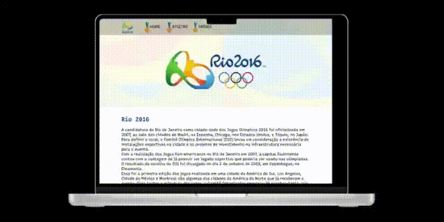
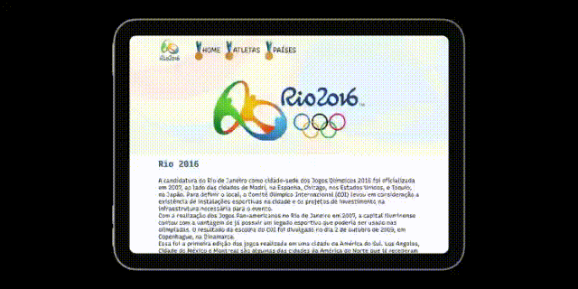

<h1 align="center"> Data Lovers - Jogos Olímpicos Rio 2016 </h1>
<h4 align="center">Status do projeto: Em construção </h4>

---

## Índice

- [Descrição](#descrição)
- [História de usuários](#história-de-usuários)
- [Desenho de interface do usuário](#desenho-de-interface-do-usuário)
- [Testes Unitários](#testes-unitários)
- [Tecnologias utilizadas](#tecnologias-utilizadas)
- [Desenvolvido por](#desenvolvido-por)

## Descrição

O projeto Data Lovers Olímpiadas, foi escolhido por nós por ser um tema muito interessante e que estamos habituadas. Nele, desenvolvemos uma aplicação web baseada no banco de dados, onde continham os dados de cada atleta participante, como idade, sexo, país, entre outros.

Buscamos todas as informações sobre o tema para que tivessemos uma base de como agregar em nossa aplicação de forma leve e que remetesse as olímpiadas, assim que entrássemos no site.

Nossa aplicação tem três vertentes para que o usuário possa navegar, sendo elas, a página "Home", onde o usuário poderá ler sobre curiosidades e informações sobre as olímpiadas do Rio 2016, a página "Atletas", onde o usuário tem a possibilidade de pesquisar os atletas pelo nome, ordenar de A-Z e Z-A, filtrar pela medalha ganha nos jogos e também filtrar pelo esporte que cada atleta pratica, e por fim a página "Países", nela há a possibilidade de filtrar cada país por ordem alfabética crescente e decrescente, os cards apresentados nesta tela contém também, a quantidade de atletas de acordo com cada país.

## História de usuários

Escolhemos dois tipos de usuários para adequar uma aplicação que se baseasse em suas necessidades.

**Usuário 1**

**Usuário 2**

## Desenho de interface do usuário

Após decidirmos o tema e fazermos uma breve pesquisa sobre sites com o mesmo tema chegamos a conclusão de que um site simples e direto seria a melhor opção. A paleta de cores foi baseada nas cores do logo e tema dos jogos olímpicos Rio 2016.

#### Protótipo de baixa fidelidade

Por se tratar de um projeto responsivo criamos o protótipo de alta fidelidade para os dispositivos mais utilizados: smartphone, notebook/desktop e tablet.

#### Protótipo de alta fidelidade para smartphone

**Protótipo de alta fidelidade para notebook/desktop**

**Protótipo de alta fidelidade para tablet**

## Testes Unitarios

Enviamos o site para alguns usuários com o intuito de avaliar a interatividade e design. O feedback recebido foram a sugestão de inserir a foto de cada atleta em seu respectivo card, melhorar o design da barra onde se encontra os campos de filtrar e ordenar e desenvolver um ranking de medalhas, porém por não termos tempo hábil no momento, optamos apenas por melhorar a disposição dos campos de filtrar e ordenar e futuramente atender as outras necessidades do usuários.

## Tecnologias Utilizadas

- HTML5
- CSS3
- JavaScrip
- Node.js
- Git
- Figma
- Jest

## Como Executar o Projeto
Para conseguir rodar a aplicação e os teste é necessário ter instalado na sua máquina o [Git](https://git-scm.com/), [Node.js](https://nodejs.org/en/)  e um editor de código da sua escolha.

- No terminal, clone o projeto:
  - git clone https://github.com/jaquelinedeoliveira93/SAP007-data-lovers
- Entre na pasta do projeto:
  - cd SAP007-data-lovers
- Instale as dependências:
  - npm install
- Execute a aplicação:
  - npm start

Para realizar os testes, faça o seguinte:
- No terminal, na pasta do projeto:
  - cd SAP007-data-lovers
- Execute o teste:
  - npm test

## Desenvolvido por

Jaqueline de Oliveira - [LinkedIn](https://www.linkedin.com/in/jaquelinedeoliveiraa/) - [GitHub](https://github.com/jaquelinedeoliveira93)

Larissa Santos - [LinkedIn](https://www.linkedin.com/in/larissa-dos-reis-santos-aaa8b415a/) - [GitHub](https://github.com/Larasantos97)
