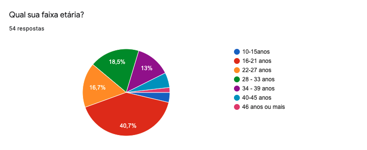
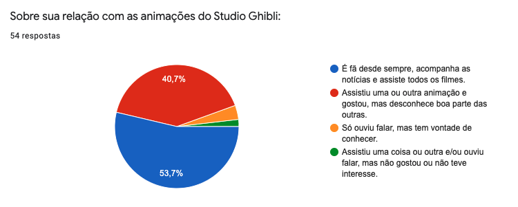
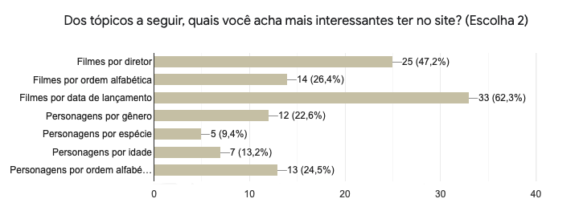
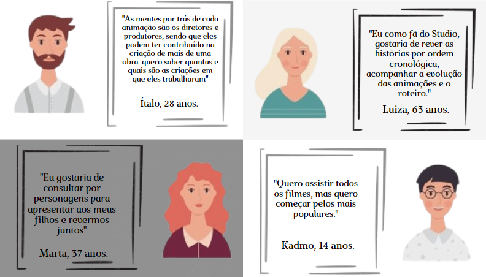
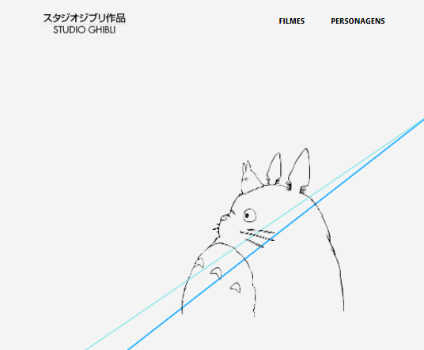
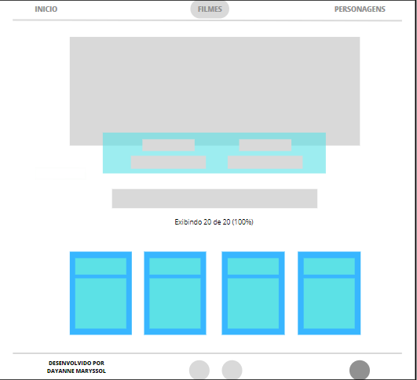
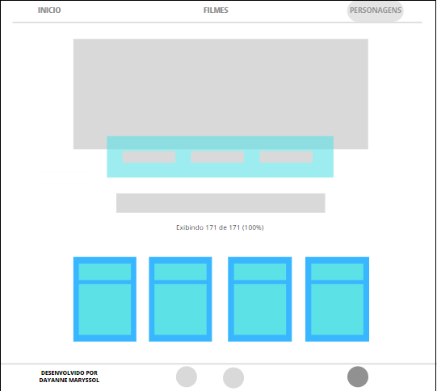
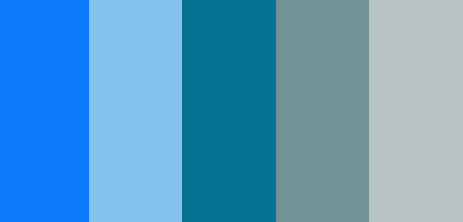
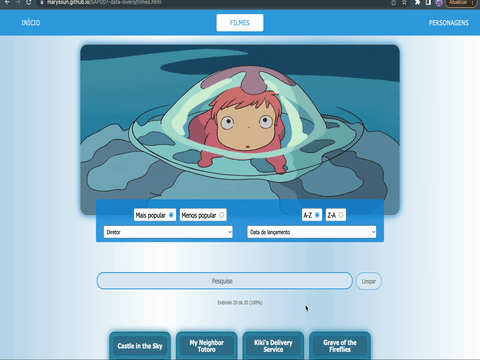

# Data Lovers  Studio Ghibli

 
 ***
## Índice

- [1. O Projeto](#1-O-projeto)
- [2. História de usuário](#2-História-de-usuario)
- [3. Protótipo](#3-Protótipo)
- [4. Projeto final](#4-Projeto-final)
- [5. Implementações futuras](#5-Implementações-futuras)
- [6. Projeto - II](#6-Projeto-II)
- [7. Autora](#7-Autora)

---

## 1. Sobre o projeto

Desenvolvido por [Dayanne Maryssol](https://www.linkedin.com/in/dayannemaryssol/), durante o Bootcamp da Laboratória da turma 007.

O objetivo principal deste projeto foi aprender a desenhar e construir uma interface web onde se possa visualizar e manipular dados, entendendo o que o usuário necessita. A temática escolhida foi o universo do - [Studio Ghibli](https://pt.wikipedia.org/wiki/Studio_Ghibli), que é um estúdio japonês de animação, muito conhecido por seus filmes como **Meu Amigo Totoro, A Viagem de Chihiro, O Castelo Animado**, entre outros grandes sucessos.
As animações são bem recebidas em todo o mundo e algumas receberam várias nomeações e prêmios. De todo esse fandom há um grupo que deseja interagir e ver as informações das animações e seus personagens.

O site comporta dados a respeito do filme e dos personagens, para que o usuário possa filtrar, ordenar e buscar por informações de seu interesse. O público alvo são jovens a partir de 12 anos, pois, ainda que o público alvo do Studio Ghibli englobe crianças por conta das animações, é necessário que o usuário possa ler e interpretar as informações apresentadas.

O site permite que o usuário filtre os filmes por diretor e ano de lançamento, ordene os filmes por ordem alfabética, pesquise os filmes de seu interesse e recarregue a página quando lhe for conveniente. A página dos personagens, por sua vez, permite que o usuário filtre-os por gênero e espécie e os ordene por ordem alfabética, bem como pesquise os personagens e recarregue a página.

---

## 2. Pesquisa

Utilizei o Google Forms como ferramenta para realizar a pesquisa visando descobrir qual é a idade dos usuários e quais seriam os seus interesses na aplicação web que seria desenvolvida.

Obtivemos os seguintes resultados:

 

* 40,7% dos usuários tem entre 16-21 anos e mais de 30% tem entre 22-33 anos.*

 

* 53,7% já conhecem as animações e se declaram fãs das animações.*
  

 

* Parte significativa dos entrevistados afirmaram ter interesse em pesquisar filmes por diretor, ano de lançamento e por ordem alfabética dos personagens.*

### História de usuário

# Quem são os usuários?

. Crianças a partir dos 7 anos que já iniciaram a leitura e escrita;
. Pessoas com deficiência visual;
. Fãs e simpatizantes de animes e mangás;
. Pessoas que gostam de histórias relacionadas a cultura japonesa;
. Consome conteúdo de qualidade, criativo, ilustrações;
. Gosta de assistir filmes de aventura e fantasia;

 

**Definição de produto:** o usuário precisa escolher como quer ordenar as animações, bem como filtrar os personagens e os filmes, obtendo um cálculo da porcentagem que cada opção representa em relação a todas as animações.

---

## 3.Protótipo

No início do projeto, utilizei o [Canva](https://www.canva.com/) como ferramenta para esboçar um protótipo de baixa fidelidade. O wireframe foi elaborado com a finalidade de permitir que a navegação do usuário se dê pelas seguintes páginas: a página inicial, a página dos filmes e a página dos personagens, bem como o link para os perfil da autora e o link para o site da Laboratoria no rodapé.

- A pagina inicial:

 

- A página de Filmes: 

 

- A página de Personagens:

 

* Cada página possui destaque no menu de referência para orientação de navegação. Quando o usuário estiver na página de Filmes, o menu ficará destacado, como podemos ver no protótipo.

- A definição da paleta de cores foi baseada em tons de azul, seguindo a identidade visual do Studio, assim como a sua logo, foi minha inspiração principal.

 

---

## 4. Projeto final

A página inicial contém na barra de navegação opções das páginas de “Filmes” e “Personagens”. O logo utilizado encaminha o usuário para a página oficial do estúdio em uma nova janela.

---

## 5. Implementações futuras

- Adicionar uma página de curiosidades.
- Implementação de um tradutor de Libras na tela (feito: 20/06/2022) ✔️
- Menu hamburguer para responsividade em telas pequenas.
- Modal nos cards onde apareça mais informações sobre os filmes e os personagens.

---

## 6. Projeto II

- Tive a oportunidade de desenvolver um segundo [projeto](https://github.com/leticiaantunesjpeg/SAP007-data-lovers) junto com minha colega [Leticia Antunes](https://github.com/leticiaantunesjpeg).

- Fizemos uma [pesquisa](https://www.canva.com/design/DAE3-YMQvbE/view?utm_content=DAE3-YMQvbE&utm_campaign=designshare&utm_medium=link&utm_source=publishsharelink) com os usuários para a idealização do produto.

- Planejamos o design através do Canva e ficou [assim](https://www.canva.com/design/DAE4EHzgZD0/lDFEg3JauA7tJ4q-WJ3EQQ/view?utm_content=DAE4EHzgZD0&utm_campaign=designshare&utm_medium=link&utm_source=publishsharelink).

- Nos organizamos através da ferramenta [Trello](https://trello.com/b/jfg3MgmE/data-lovers).

- E aqui você encontra o resultado: https://leticiaantunesjpeg.github.io/SAP007-data-lovers/

---

## 7. Sobre a autora

 

     
 

 
  <h3 align="center"><a href="https://github.com/Maryssun">Dayanne Maryssol</a></h3>
  <h4 align="center">Projeto do Bootcamp da <em><a href="https://hub.laboratoria.la/br">Laboratoria</a></em></h4>
  

    
    
  

