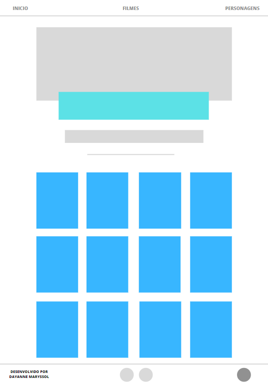

# Data Lovers  Studio Ghibli

 
 ***
## Índice

- [1. Apresentação](#1-Apresentação)
- [2. Resumo do projeto](#2-Resumo-do-projeto)
- [3. Histórias de usuário](#3-Histórias-de-usuário)
<!-- * [3. Protótipo e UX](#computer-protótipo-e-UX)
* [4. Organização](#card_file_box-Organização)
* [5. Resultados](#%EF%B8%8F-resultados)
* [6. Tecnologias](#robot-tecnologias)
* [7. Sobre a autora](#woman_technologist-sobre-a-autora)
 -->
---
## 1. Apresentação

Esse projeto foi desenvolvido por Dayanne Maryssol, durante o Bootcamp da Laboratória da turma 007.

---
## 2. Resumo do projeto

O objetivo principal deste projeto foi aprender a desenhar e construir uma interface web onde se possa visualizar e manipular dados, entendendo o que o usuário necessita. A temática escolhida foi o universo do - [Studio Ghibli](https://pt.wikipedia.org/wiki/Studio_Ghibli), que é um estúdio japonês de animação, muito conhecido por seus filmes como **Meu Amigo Totoro, A Viagem de Chihiro, O Castelo Animado**, entre outros grandes sucessos. 
As animações são bem recebidas em todo o mundo e algumas receberam várias nomeações e prêmios. De todo esse fandom há um grupo que deseja interagir e ver as informações das animações e seus personagens.

O site comporta dados a respeito do filme e dos personagens, para que o usuário possa filtrar, ordenar e buscar por informações de seu interesse. O público alvo são jovens a partir de 12 anos, pois, ainda que o público alvo do Studio Ghibli englobe crianças por conta das animações, é necessário que o usuário possa ler e interpretar as informações apresentadas.

O site permite que o usuário filtre os filmes por diretor e ano de lançamento, ordene os filmes por ordem alfabética, pesquise os filmes de seu interesse e recarregue a página quando lhe for conveniente. A página dos personagens, por sua vez, permite que o usuário filtre-os por gênero e espécie e os ordene por ordem alfabética, bem como pesquise os personagens e recarregue a página.

---
<!-- ## 3. Histórias de usuário
As histórias de usuário [detalhadas neste link](https://www.canva.com/design/DAE3-YMQvbE/view?utm_content=DAE3-YMQvbE&utm_campaign=designshare&utm_medium=link&utm_source=publishsharelink) foram a base de desenvolvimento do protótipo e posterior construção da interface do site levando em conta que cada história descreve uma necessidade do usuário a ser contemplada por uma funcionalidade.

---
## :computer: Protótipo e UX

O protótipo foi elaborado com a finalidade de permitir que a navegação do usuário se dê pelas seguintes páginas: a página inicial, a página dos filmes e a página dos personagens, bem como os links para os perfil da autora e o link para o site da Laboratoria no rodapé.

Em um teste de usabilidade com um suposto usuário, foi indicado que seria confuso se a página "filmes" indicasse apenas para a página "personagens" e vice-versa pois o usuário teria dificuldade para localizar em qual página se encontra. Portanto, ambas as páginas contam com "Início/Home", "Filmes" e "Personagens".

---
## :card_file_box: Organização

A organização e planejamento do projeto e das pequenas tarefas a serem executadas foi exclusivamente realizada pela plataforma trello, [neste quadro](https://trello.com/b/jfg3MgmE).

---
## ✔️ Resultados

---
## :robot: Tecnologias Utilizadas

- HTML 5
- CSS3
- JavaScript
- Node.js

---
## :woman_technologist: Sobre a autora
 -->
### Dayanne Maryssol

- [LinkedIn](https://www.linkedin.com/in/dayannemaryssol/)
<!-- - [E-mail](maryssol.dayanne@gmail) -->

