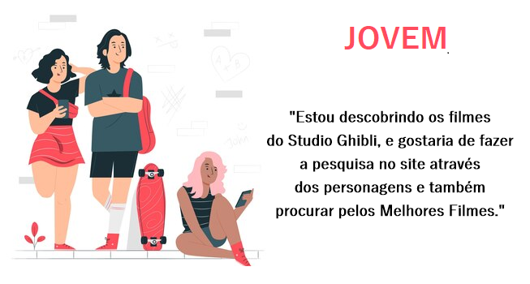

# Data Lovers

 ---

## Índice

- [1. Preâmbulo](#1-preâmbulo)
- [2. Resumo do projeto](#2-resumo-do-projeto)
- [3. Pesquisa](#3-pesquisa)
- [4. Histórias de usuários](#4-historias-de-usuarios)
- [5. Protótipos](#5-prototipos)
- [6. Teste de usabilidade](#6-teste-de-usabilidade)
- [7. Considerações finais](#7-considerações-finais)

---

## 1. Preâmbulo

Segundo a
[Forbes](https://www.forbes.com/sites/bernardmarr/2018/05/21/how-much-data-do-we-create-every-day-the-mind-blowing-stats-everyone-should-read)
90% dos dados que existem hoje foram gerados durante os últimos dois anos. A
cada dia geramos 2.5 milhões de terabytes de dados, uma cifra sem precedentes.

Apesar disso, os dados por si só são de pouca utilidade. Para que essas grandes
quantidades de dados se convertam em **informação** compreensível para os
usuários, precisamos entender e processar estes dados. Uma forma simples de
fazer isso é criando _interfaces_ e _visualizações_.

Na imagem seguinte, você pode ver como os dados que estão na parte esquerda
podem ser usados para construir a interface amigável e compreensível que está na
parte direita.

## 2. Resumo do projeto

### Definição de produto

Este projeto consistem em ordenar e filtras alguns dados e eventualmente mostrar um valor agregado referente a temática escolhida.
Para este novo desafio optei por construir uma interação sobre o Studio Ghibli, onde o usuário poderá classificar suas pesquisa por Título dos filmes, Diretor, Personagens ou o ano de seu lançamento.

### Histórias de usuário

**Historia 1**

**História 2**
 

### Desenho de interface do usuário

Gráficos Form
64% dos entrevistados se declararam como mulher e estimasse que a sua faixa etária está entre 25 e +30 anos.

A paleta de cores a ser utilizada será do filme The Secret World of Arrietty.

#### Protótipo de baixa fidelidade

#### Protótipo de alta fidelidade

#### Testes de usabilidade

Durante o desafio você deverá fazer testes de usabilidade com usuários
diferentes, e com base nos resultados desses testes, iterar seus desenhos de
interface. Conte-nos quais problemas de usabilidade você detectou através dos
testes e como os resolveu na proposta final.

## 7. Considerações finais

