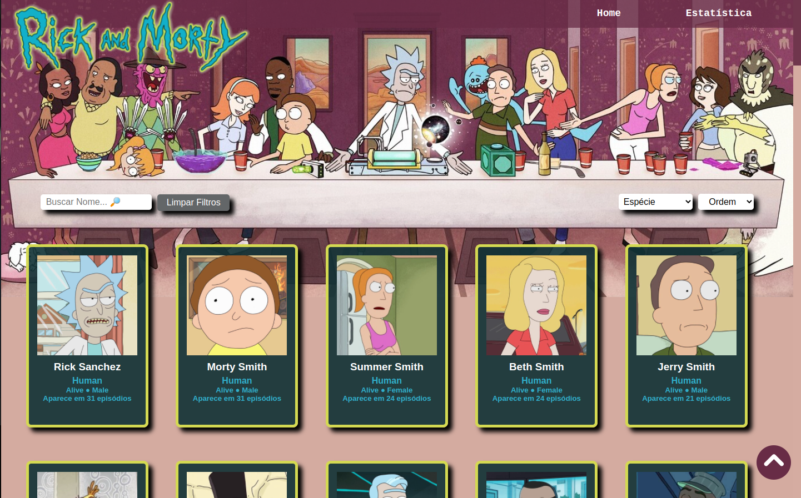

# **RICK AND MORTY EXPLORER**

## **Índice**

- [1. Resumo do projeto](#1-resumo-do-projeto)
- [2. Definição de produto](#2-definicao-de-produto)
- [3. Implementação da interface de usuário](#3-implementação-da-interface-de-usuário)
- [4. Testes unitários](#4-testes-unitários)
- [5. Considerações técnicas](#5-considerações-técnicas)
- [6. Considerações Finais](#6-considerações)

---

## **1. Resumo do projeto**

O objetivo deste projeto é construir uma página web para visualizar um conjunto de dados sobre os personagens da série Rick and Morty que se adapte às necessidades do usuário. Essa página possibilita tanto visualizar todos os personagens como filtrar, ordenar os dados e mostrar informações relevantes através de cálculos agregados e gŕaficos.

Para visualizar o projeto [clique aqui](https://karolsontak.github.io/SAP007-data-lovers/)

### **Sobre a série**

Rick and Morty é uma série de animação adulta norte-americana de comédia e ficção científica criada por Justin Roiland e Dan Harmon para o bloco de programação noturno Adult Swim, exibido no canal Cartoon Network.

A série estreou em 2 de dezembro de 2013 e acompanha as perigosas aventuras do cientista alcoólatra Rick e seu neto Morty, que divide seu tempo entre a vida familiar e viagens interdimensionais.

---

## **2. Definição de produto**

Este produto tem o intuito de sanar a necessidade do consumidor da série Rick and Morty em ter acesso a mais detalhes dos personagens que fazem parte do dia a dia do seriado. Permitindo então, que ele possa localizar os personagens através de uma busca por nome, filtro de espécie, ordenação e ainda trás informações mais detalhadas como o gênero, status de vivo ou morto e em quanto episódios aparecem.

### **Histórias de usuário**

Para atender as expectativas do usuário, uma pesquisa de campo com telespectadores da série foi feita para conseguirmos acessar as informações que seriam pertinentes de conter no nosso produto, abaixo você pode acompanhar os quatro perfis que encontramos para darmos início ao nosso projeto:

|   	|
|---	|
|   	|
|   	|
|   	|

### **Desenho de interface do usuário**

#### **Protótipo de baixa fidelidade**

Após a definição das histórias de usuário, começamos a pensar nas possibilidades de como o projeto poderia sair do campo das ideias e começar a tomar forma, por isso, desenvolvemos um protótipo primário, de baixa fidelidade do que poderia vir a ser esse produto.


#### **Protótipo de alta fidelidade**

O passo seguinte foi desenhar uma Interface de Usuário (UI - _User Interface_).
Para isso, utilizamos o Figma e apresentamos o que seria _ideal_ em nossa solução. Digamos que é
a forma que imaginamos inicialmente o projeto.


#### **Paleta de cores**

A paleta de cores foi definida a partir da imagem de background 

&nbsp;


### **Testes de usabilidade**

Durante o processo, encontramos problemas de usabilidade no scroll muito longo causado pelos 493 personagens sendo exibidos na tela, nossa solução foi incluir um botão de voltar ao topo, facilitando assim a experiência.
Melhoramos o desempenho do carregamento das imagens incluindo um loading='lazy' no template string dos cards fazendo com que as imagens fossem carregadas por partes, acompanhando o scroll da tela.

---

## **3. Implementação da interface de usuário (HTML/CSS/JS)**

Nossas implementações permeiam em:

- [x] Mostrar os dados em cards.
- [x] Permitir ao usuário interagir com a interface para obter as informações que
   necessita;
- [x] Ser _responsiva_, ou seja, pode ser visualizada sem problemas a partir de
   diversos tamanhos de tela: celulares, tablets, notebooks, etc.
- [x] Exibir cálculos agregados ao filtro permitindo que o usuário visualize a porcentagem de personagens representadas por cada espécie.

---

&nbsp;
Versão final para computador:
&nbsp;


---

&nbsp;
Versão final responsiva:

&nbsp;


---

## **4. Testes unitários**

Escrevemos nosso próprio teste para as funções encarregadas de _processar_,
_filtrar_ e _ordenar_ os dados, assim como _calcular_ estatísticas.

Nossos testes unitários tem cobertura de 100% de _statements_
(_sentenças_), _functions_ (_funções_), _lines_ (_linhas_), e _branches_
(_ramos_) do arquivo `src/data.js`, que contém nossas funções e que está
detalhada na seção de [Considerações técnicas](#srcdatajs).

&nbsp;


---

## **5. Considerações técnicas**

A lógica do projeto está implementada somente em JavaScript (ES6), HTML e
CSS. Neste projeto não há uso de bibliotecas e frameworks, apenas [vanilla
JavaScript](https://medium.com/laboratoria-how-to/vanillajs-vs-jquery-31e623bbd46e),
com exceção das bibliotecas para gráficos.

O _boilerplate_ contém uma estrutura de arquivos como ponto de partida, assim
como toda a configuração de dependências:

```text
.
├── coverage
├── image-readme
├── node_modules
├── src
|  ├── data/rickandmorty 
|  |  |  ├── rickandmorty.js
|  |  |  ├── rickandmorty.json
|  |  |  └── README.md
|  ├── image 
|  |  |  └── bgresponsivo.jpg
|  |  |  ├── bg-purple.jpg
|  |  |  ├── favicom.ico
|  |  |  └── home.png
|  |  |  └── logo.png
|  |  |  └── topo.png
|  ├── data.js
|  ├── estatisticas.css
|  ├── estatisticas.html
|  ├── estatisticas.js
|  ├── index.html
|  ├── main.js
|  └── style.css
└── test
   └── data.spec.js
├── package-lock.json
├── package.json
├── README.md

```

### `src/index.html`

No arquivo `index.html` se encontra a página a ser exibida ao usuário. 
Também serve para indicar quais scripts serão utilizados e juntar tudo o que foi feito.

### `src/main.js`

No arquivo `src/main.js` todos os códigos que tenham a ver com a exibição dos dados na tela. 
Com isto nos referimos basicamente à interação com o DOM. 
Operações como criação de laços, registro de manejadores de eventos (_event listeners_) e etc.

### `src/data.js`

O coração deste projeto é a manipulação de dados através de arrays e objetos.

Neste arquivo contém toda a funcionalidade que corresponda a obter, processar e 
manipular dados (suas funções).

Estas funções são [_puras_](https://imasters.com.br/desenvolvimento/serie-js-e-vida-pure-functions-funcoes-puras)
e independentes do DOM. Estas funções serão depois usadas a partir do arquivo
`src/main.js`, ao carregar a página e a cada vez que o usuário interagir com a
interface (cliques, seleções, filtros, ordenação, etc).

### `src/data`

Nesta pasta estão os dados de diferentes fontes. Você vai encontrar uma pasta
para cada fonte, e dentro de cada pasta estão dois arquivos: um com a extensão
`.js` e outro `.json`. Ambos os arquivos contém os mesmos dados; a diferença é
que podemos usar o `.js` com uma tag `<script>`.

### `test/data.spec.js`

Aqui se encontram os teste unitários das funções implementadas no arquivo
`data.js`.

---

## **6. Considerações Finais** 

- [x] O planejamento deste projeto se encontra no [Trello](https://trello.com/b/15NqEjgG/data-lovers-rick-and-morty)
- [x] O repositório deste projeto se encontra no [GitHub](https://github.com/karolsontak/SAP007-data-lovers)
- [x] O deploy deste projeto está hospedado no [GitPages](https://karolsontak.github.io/SAP007-data-lovers/)
- [x] Este projeto foi desenvolvido por [Dayane Rodrigues](https://github.com/dayanersilva) e [Karol Sontak](https://github.com/karolsontak).