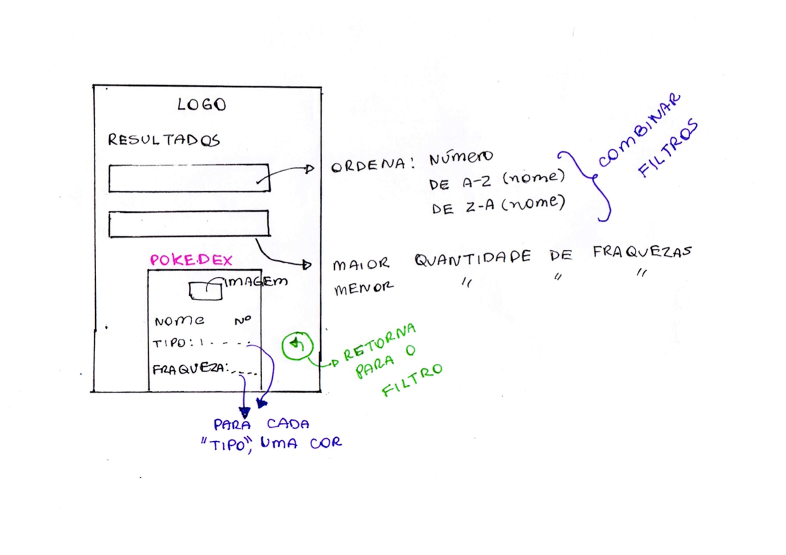
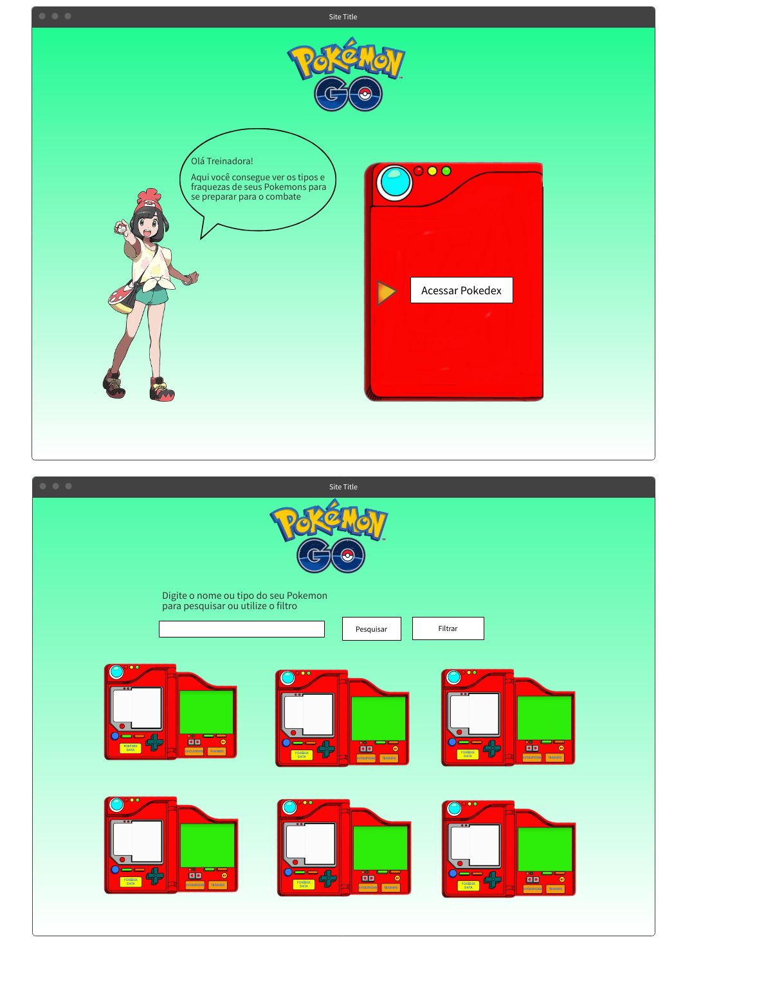

   

## Escolha os seus pokemóns para combate, filtrando por tipo e fraqueza.

  
  
  

---
  
## ÍNDICE

- [1. PRODUTO](#1-produto)
  - [1.1. Pokémon](#11-pokémon)
  - [1.2. Histórias de Usuários](#12-histórias-de-usuários)
  - [1.3. Onpokemon](#13-onpokemon)
- [2. PROTÓTIPOS](#2-protótipos)
  - [2.1 Protótipo de Baixa Fidelidade](#21-protótipo-de-baixa-fidelidade)
  - [2.2 Protótipo de Alta Fidelidade](#22-protótipo-de-alta-fidelidade)
- [3. TESTE DE USABILIDADE](#3-teste-de-usabilidade)
- [4. FERRAMENTAS UTILIZADAS](#4-ferramentas-utilizadas)
- [5. CHECKLIST](#5-checklist)
- [6. AUTORAS](#6-autoras)

---
  
## 1. PRODUTO

### 1.1 Pokémon

Pokémon são criaturas de todas as formas e tamanhos que podem ser selvagens ou então aparecer ao lado de seus parceiros treinadores. Durante suas aventuras, os Pokémon crescem e se tornam mais experientes e evoluem para se tornarem Pokémon ainda mais fortes. Centenas de Pokémon conhecidos habitam o universo Pokémon, com números incontáveis esperando para serem descobertos!

Há 18 tipos diferentes de Pokémon e cada um pode ter até dois, como no caso do Bulbasaur, que é grama e venenoso. Cada tipo tem maior ou menor chance do golpe usado causar dano no inimigo, o resultado dependerá do tipo do adversário e se o seu ataque é do seu mesmo tipo.
  
Os Pokémons têm diferentes tipos e fraquezas em combate. Estas características são importantes na escolha do Pokémon mais adequado para sua batalha. Às vezes, você tem que escolher aqueles com menos fraquezas e saber de que tipo eles são. Portanto, é importante que um mestre de Pokémon seja capaz de ordená-los por essas 2 características.

### 1.2. Histórias de Usuários

> "Eu, como treinadora iniciante do jogo [Pokémon Go](https://play.google.com/store/apps/details?id=com.nianticlabs.pokemongo&hl=pt_BR&gl=US), desejo pesquisar os meus Pokémons, filtrando-os por tipos e fraquezas, para escolher os mais adequados para as minhas batalhas no jogo.
  
> "Como treinador do jogo Pokémon Go, quero buscar mais de um nome dos meus Pokémons, ordenando-os por tipos e visualizando mais informações sobre cada um deles, descobrindo suas fraquezas, desse modo poderei batalhar mais confiante para ser um mestre Pokémon."
  
### 1.3. OnPokemon

_OnPokemon_ é um site de filtragem em Pokémons por: nome, tipos e fraquezas de cada um deles. Os resultados da pesquisa são mostrados na tela, ordenados por números da [Pokédex Nacional](https://pokemon.fandom.com/pt-br/wiki/Pok%C3%A9dex_Nacional), por nomes em ordem alfabética crescente e decrescente e, podendo serem mesclados pela maior ou menor quantidade de fraquezas.

Os principais usuários do _OnPokemon_, são os jogadores (treinadores) que desejam saber informações sobre seus Pokémons para batalhar com outros treinadores no jogo Pokémon Go. Para eles, é essencial saber o tipo e fraquezas de seus Pokémons e poder visualizá-los em qualquer lugar, como em celular, tablet e notebook, sem alterar as configurações visuais dos dados mostrados na tela.
  
## 2. PROTÓTIPOS

- OnPokemon é um projeto desenvolvido em 2022, para o bootcamp da Laboratoria Brasil.
- Esse projeto é baseado nas instruções apresentadas pelo README do [Data-love](https://github.com/Laboratoria/SAP007-data-lovers).
- Para iniciar o projeto, iniciamos com um planejamento realizado no site Trello, com base em [Babys Steps](https://blogprisma.com.br/baby-steps/) e na metodologia [Scrum](http://www.desenvolvimentoagil.com.br/scrum/), com sprints de uma semana, totalizando em quatro sprints.

### 2.1. Protótipo de Baixa Fidelidade

- Para realizar o projeto do bootcamp Laboratoria, foi realizado primeiro um protótipo simples (baixa fidelidade) usando papel e lápis. Nesse protótipo, foi pensado no conceito de [Mobile First](https://www.chiefofdesign.com.br/design-responsivo/mobile-first/) que prioriza quais elementos são prioridade na exibição para o usuário e quais podem ser descartados.
- No _OnPokemon_ foi priorizado as informações essenciais, como: explicação sobre o uso do site, explicações para preenchimento do formulário de filtragem e nos resultados visualizado.

    - _**PARA MOBILE (CELULAR):**_
 

         

               
         

         

             
         

    - _**PARA DESKTOP (NOTEBOOK):**_
 

        

             
        

    
### 2.2. Protótipo de Alta Fidelidade
  

 
 ESTILO
 RESPONSIVIDADE
  TIPOGRAFIA E HIERARQUIA
  CORES E CONTRASTES
  
  TELAS MENSAGENS E BOTÕES
  ARQUITETURA DE INFORMAÇÃO

  statcounter - site de pesquisa de tela de celular, tablet e desktop
  
  
## 3. TESTE DE USABILIDADE

## 4. FERRAMENTAS UTILIZADAS
  
- **Planejamento:**

  - **Scrum:** _[Trello](https://trello.com)_

- **UX/UI**:

  - **Edição de Imagens:** _[Canvas](https://www.canva.com/pt_br/)_
  - **Paleta de Cores com Acessibilidade:** _[Adobe Color](https://color.adobe.com/pt/create/color-wheel)_
  - **Protótipo:** _[Figma](https://www.figma.com/)_
  - **Para fazer Gif:** _[Canvas](https://www.canva.com/pt_br/)_

- **Web:**
  - **Editor:** _[Visual Studio Code](https://code.visualstudio.com/)_
  
## 5. CHECKLIST

- [ ] Usar VanillaJS.
- [ ] Passa pelo linter (`npm run pretest`)
- [ ] Passa pelos testes (`npm test`)
- [ ] Testes unitários cobrem um mínimo de 70% de statements, functions, lines e
      branches.
- [ ] Inclui uma _definição de produto_ clara e informativa no `README.md`.
- [ ] Inclui histórias de usuário no `README.md`.
- [ ] Inclui rascunho da solução (protótipo de baixa fidelidade) no `README.md`.
- [ ] Inclui uma lista de problemas detectados nos testes de usabilidade no
      `README.md`.
- [ ] UI: Mostra lista/tabela/etc com dados e/ou indicadores.
- [ ] UI: Permite ordenar dados por um ou mais campos (asc e desc).
- [ ] UI: Permite filtrar dados com base em uma condição.
- [ ] UI: É _responsivo_.

## 6. AUTORAS 

### [Adriana Tiemi Watanabe](https://github.com/adrianatwatanabe)

**Projeto do Bootcamp da _[Laboratoria](https://hub.laboratoria.la/br)_**

<a href = "mailto:adriana.t.watanabe@gmail.com" target="_blank">

  
### [Beatriz de Souza Carvalho](https://github.com/BeaSCarvalho)

**Projeto do Bootcamp da _[Laboratoria](https://hub.laboratoria.la/br)_**

<a href = "mailto:beaproscarva@gmail.com" target="_blank">

